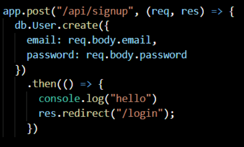
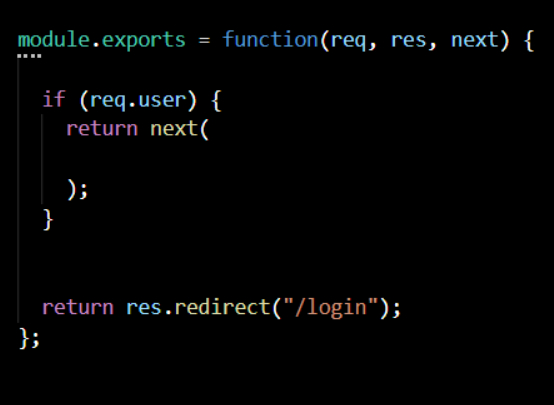
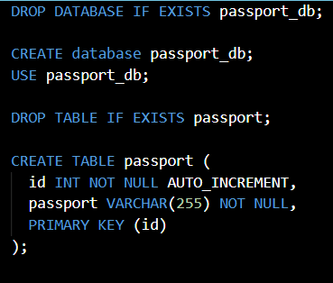

# *Constructing a Login App with Middleware*
---
> ## **My Story**

AS A developer

I WANT a walk-through of the codebase

SO THAT I can use it as a starting point for a new project

---
> ## **Table of Contents**
* [App Setup](#App-Setup)
* [Server.js setup](#Server.js-setup)
* [Create the Look](#Create-the-Look)
* [Major Changes](#Major-Changes)
* [Resources](#Resources)
---
>## **App Setup**

### 1. Open a new folder and call it *new project*.
### 2. Open a new terminal and run the following npm installs: 
 * [Express](https://www.npmjs.com/package/express)-'Renders HTML '
 * [Express-session](https://www.npmjs.com/package/express-session)-'Handles middleware'
 * [Passport](https://www.npmjs.com/package/passport)-'Authenticates requests'
 * [Passport-local](https://www.npmjs.com/package/passport-local)-'Authenticates using a username and password' 
 * [Bcryptjs](https://www.npmjs.com/package/bcryptjs)
    -'For password hashing'
 * [Sequelize](https://sequelize.org/)-'To combine requests'

---
>## **Server.js setup**

### 1. Create a js file called *Server*.
### 2. Require express to render are HTML Pages based on passing arguments.
### 3. Require Passport to connect to *passport.js*:

* ### Create a folder called *config*:
* Setup a js file called *passport* Inside config folder.
* This file will require passport and passport-local.
* It will run code to throw a 'correct' or 'incorrect' responce when the user trys to sign in.

### 4. Back in *server.js* require session to connect the middleware:

* ### Create a folder called *middleware* inside config folder:
* Setup a js file called *isAuthentaicated* inside.
* Require Session to connect the middleware.
* User infomation must be copatble with the given options.

### 5. Back in the server.js, setup a local port at 8080. 
* *This connects to the localhost.*

### 6. Require a connection to the database models *indes.js* and *user.js*:
* ### Create a folder called *models*
* Setup a js file called *index* inside.
* Use Strict.
* Require fs, path, sequelize, env, and db.
* Setup a js file called *user* inside.
* Require bcrypt to protect the user password infomation.
* Validates password and returns user.

### 7. Back in the *server.js* configure the fuctions inside  a express const app:
* Use express.json to connect to js in publics folder
* Use express.static to force options given in middleware to index.js
* Use passport.initialize to render user infomation
* Use passport.session to keep user infomation logged in

### 8. Reqiure a route for html
* ### Create a folder called *routes*
* Create a file called *html-routes.js* 
* Require path in this file for the html routes. 
* This file will check the user input information and re-routes it. 
### 9. Reqiure a route for api.
* Create a file called *api-routes.js*
* This file concects to the api we consturcted after running a check with the middleware.

### 10. Back in the *server.js* sync the database and logging id:
* Sync the databse with sequelize.
* Console.log to check the port.

### 11. Create a database
* Call database *passport_demo*.
* Set it to be droped if it already exists.

### 12. Config the json file called *config*
* Set the database to be 'passport_demo'.
* Change the password to your personal database password.
---
>## **Create the Look**

### 1. Create a folder called *public* 
### 2. Setup a html file called *login* inside
* This file will have the html infomation for the *Login** page.
### 3. Setup a html file called *members* inside
* This file will have the html infomation for the *members* page.
### 4. Setup a html file called *signup* inside
* This file will have the html infomation for the *signup* page.

### 5. Create a folder called *stylesheets* inside
* ### Setup a css file called *Style* inside
* Set the Margins of "form.signup" to 50 px from top.
* Set the Margins of "form.login" to 50 px from top.

### 6. Create a folder called *js* in the public folder
### Setup a js file called *login* inside
* This file will have the javascript infomation for the *Login** page.
### Setup a js file called *members* inside
* This file will have the javascript infomation for the *members* page.
### Setup a js file called *signup* inside
* This file will have the javascript infomation for the *signup* page.
---
>## **Major Changes**

* ### Changed redirect to go to login page if already signed up.
 

* ### Changed redirect to go back to login page after logging out.
 

* ### Added database to store ids 'emails' and paswords.

---
> ## **Resources:**
* [Nodejs](https://nodejs.org/en/)
* [Express](https://www.npmjs.com/package/express)
* [Express-session](https://www.npmjs.com/package/express-session)
* [Passport](https://www.npmjs.com/package/passport)
* [Passport-local](https://www.npmjs.com/package/passport-local)
* [Bcryptjs](https://www.npmjs.com/package/bcryptjs)
* [Sequelize](https://sequelize.org/)
---
>## [Back to top.](#Constructing-a-Login-App-with-Middleware)
